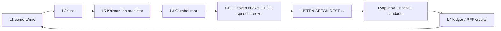

# Φ-Lite: The Shielded Attractor

**v0.5.3** · browser console for a thermodynamically bounded scalar agent.

Not AGI. Honest stage floor **S2.9**. Stage 4 language is a research *target*, not a claim.

The loop is: sense → predict → act → residual → metabolize → remember, behind a fail-closed shield. Camera and microphone bind through the browser and stay bound when you leave the Sensors view. Every run can dump a science-grade JSON / Markdown report.

```
seed 49 · live camera+mic · 3552 cycles · alive · ECE 0.14 · halt none
```

That 0.5.3 trace is the first one that is actually a *run*. Earlier builds froze at cycle 81 (false template-lock) or 401 (ECE calendar halt) or died of a fatigue trap at 941.

## Honesty

| Claim | Status in v0.5.3 |
|---|---|
| Closed sense–act loop | Yes, scalar |
| Live camera / mic | Yes, persistent bus |
| Lyapunov + metabolic costs | Yes; starvation drain still open |
| ECE calibration | Residual-based; **looks good on a still/dark frame** |
| SPEAK gated by uncertainty / ECE | Yes |
| Kill switch, persist-halt, Reset re-arm | Yes |
| Tensor RSSM, MAML, 10⁶-cycle V&V | **No** |
| Stage ≥ 3 | **No. Do not upgrade without a new metrics window.** |

A covered webcam will drive predErr → 0 and ECE below 0.2. That is not a world model. Wave at the lens. If novelty does not spike and LISTEN does not fire, the plant is lying.

## Requirements

- **Node.js 20.19+ or 22.12+** (Vite 8). Node 12/14/16/18 dies at the version gate with a plain error, not `Unexpected token '?'`.
- npm 10+ (ships with those Nodes)

```bash
# folder that contains package.json
nvm install 22 && nvm use 22
node -v          # v20.19+ or v22.12+
npm install
npm run dev      # 0.0.0.0:8080
# or
./startup.sh     # portable; cds to its own directory
```

`startup.sh` does not assume `/workspace`. It checks Node, checks `node_modules`, then starts the same `npm run dev` path the sandbox uses.

## Scripts

| Command | Purpose |
|---|---|
| `npm run dev` | Dev server, all interfaces, port 8080 |
| `npm run build` | Production build |
| `npm run typecheck` | `tsc --noEmit` |
| `npm test` | Platform tests + scalar core (`energy`, `loop`) |
| `npm run lint` | ESLint |

Core tests need `node --experimental-strip-types` and `scripts/ts-ext-register.mjs` (already wired in `npm test`).

## Console

| View | What it is |
|---|---|
| Command | Attractor, telemetry, loop speed, cycle budget, live camera pip |
| Sensors | Bind / release camera and mic. Stream survives navigation |
| Layers | L1–L7 scalar stack |
| Memory | Ledger, crystal, utterance chain, hash head |
| Policy | Action logits, commitments, goals |
| Safety | Consent, panic, tokens, barrier \(h\), kill |
| **Logs** | Event log, last trajectory, **Export JSON** / **Export Markdown** |
| Audit | 144 shortcomings + 48 enhancements |
| Eval | Stage estimator, kill criteria |

Header: Run / Pause / Step / Reset / Kill. Reset is the operator re-arm. Reload alone will not clear a persisted halt (`localStorage`).

Default cycle budget is 10 000. Live sensors + v0.5.3 should pass cycle 401 without a calendar freeze.

## Loop (scalar core)



Notable laws in `src/lib/phi/`:

- **Energy** — Lyapunov \(V=(1-e/B)^2+f^2\). Linear fatigue leak (f=1 is not absorbing). Collapse refractory 32 cycles. REST bleeds fatigue. \(V>1.12\) forces REST.
- **Perception** — live `z` is photons/audio only. Mock oscillators stay in mock mode only.
- **Policy** — novelty \(> 3.5\) forces LISTEN. Low energy biases REST/REPAIR. ECE warn freezes SPEAK/COMMIT without killing the loop.
- **ECE** — confidence mixes residual and softmax gap. Hard halt only if ECE is **not improving after cycle 2000** on live sensors.
- **RNG** — `spawn()` mixes evolving state. Collapse scars are not all `"perception"`.
- **Export** — `phi-lite.report.v2`: taken counts (Laplace prior stripped), barrier without panic latch, `stillFrames`.

## What the traces showed

| Run | Result | Lesson |
|---|---|---|
| 0.5.2 mock c941 | Death, 48 collapses, f=1 | Fatigue logistic trap |
| 0.5.2 live ×3 c401 | ECE halt on the calendar | Live I/O attached, perception not closed-loop |
| **0.5.3 live c3552** | Alive, ECE 0.14, LISTEN 40% | Plant patches work; **dark-frame ECE is a cheat**; basal×μ still outruns reward |

Open failure modes the hardware-limited next step should hit:

1. Starvation: basal × μ > residual-reward when energy is low.
2. Landauer ratchet, especially REST.
3. Goals are a diary — they do not enter logits.
4. Stagnation scars are hard-labeled `adaptation`.
5. Do not promote stage on ECE from a still camera.

## Layout

```
src/lib/phi/            scalar core
src/components/console/ UI
src/lib/phi/audit.ts    144 + 48 tracker
attachments/            audits, Stage 4 dump, run reports
scripts/check-node.cjs  version gate (parses on Node 12)
startup.sh              portable launcher
```

## Stage policy

Downgrades are immediate. Upgrades are slow. Kill criteria live in Eval. No stage number above S2.9 without a new metrics window **and** a disturbance protocol (uncover the lens, require ΔpredErr / ΔECE).

License: Apache-2.0.
